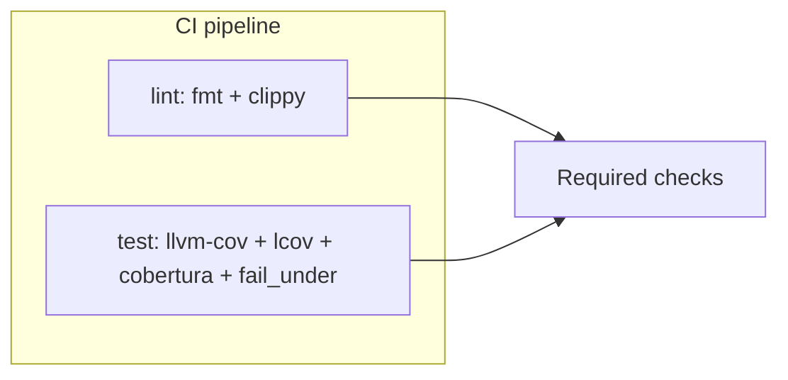

# Coverage and quality gates (llvm-cov)

This document describes how **line coverage** is measured and enforced for `tickerforge` using [cargo-llvm-cov](https://github.com/taiki-e/cargo-llvm-cov).

## Current setup

- **CI:** [`.github/workflows/ci.yml`](../.github/workflows/ci.yml) — the **`lint`** job runs `cargo fmt` and `cargo clippy`. The **`test`** job runs instrumented tests once, writes **LCOV** and **Cobertura XML** (`cobertura.xml`), uploads the XML as a workflow artifact, sends both to Codecov, and fails if line coverage is below **80%**.
- **Pre-commit:** [`.pre-commit-config.yaml`](../.pre-commit-config.yaml) — after format and clippy, **`cargo-llvm-cov`** runs the same style of check locally (LCOV + Cobertura XML + `--fail-under-lines 80`).
- **Git ignore:** `/lcov.info` and `/cobertura.xml` are ignored (see [`.gitignore`](../.gitignore)).

## Design choices

**Where the 80% gate runs in CI:** Static analysis stays in the **`lint`** job (fast). The **line coverage floor** is enforced in the **`test`** job with `cargo llvm-cov ... --fail-under-lines 80`, because that job already performs instrumentation and produces LCOV. Required branch protection can treat both jobs as required checks.

If you need the **GitHub check named `lint`** itself to fail on coverage, you would need a different layout (e.g. one combined job or duplicated workspace setup). The split above is the usual pattern.

**Metric:** **Line coverage** (`--fail-under-lines 80`). In current cargo-llvm-cov versions, fail-under must be used together with `--json`, `--lcov`, or `--cobertura`.

**Prerequisite:** The first run after enabling `--fail-under-lines 80` **fails CI** if coverage is below 80%. Confirm locally with the commands below before merging policy changes.



## LCOV and Cobertura XML in two steps

`cargo llvm-cov` does **not** combine multiple export formats in one invocation (e.g. `--lcov` with `--cobertura` in the same command). The workflow therefore:

1. Runs tests and writes LCOV with the 80% gate:  
   `cargo llvm-cov --all-features -p tickerforge --lcov --output-path lcov.info --fail-under-lines 80`
2. Generates **Cobertura XML** from the same profiling data (no second test run):  
   `cargo llvm-cov report -p tickerforge --cobertura --output-path cobertura.xml`

**Why XML:** Cobertura is widely supported (Codecov, SonarQube, dashboards, and other web tooling). **JUnit XML** is for *test case* results (pass/fail per test), not line coverage; `cargo llvm-cov` does not emit JUnit for coverage. For HTML locally, run `cargo llvm-cov report --html` (writes under `target/llvm-cov/html`).

## Local prerequisites

Install the Cargo subcommand (pick one):

```bash
cargo install cargo-llvm-cov
# or: cargo binstall cargo-llvm-cov
```

Without it, pre-commit fails when the `cargo-llvm-cov` hook runs.

## Commands

**Match CI from a workspace root** (same layout as GitHub Actions: virtual workspace with `rs` + `spec` and `[patch.crates-io]`):

```bash
cargo llvm-cov --all-features -p tickerforge --lcov --output-path lcov.info --fail-under-lines 80
cargo llvm-cov report -p tickerforge --cobertura --output-path cobertura.xml
```

**Crate root only** (no `-p`):

```bash
cargo llvm-cov --all-features --lcov --output-path lcov.info --fail-under-lines 80
cargo llvm-cov report --cobertura --output-path cobertura.xml
```

**Pre-commit** (runs the hook id `cargo-llvm-cov`):

```bash
pre-commit run cargo-llvm-cov --all-files
```

To skip the coverage hook occasionally: `SKIP=cargo-llvm-cov git commit ...`

## Verification checklist

- [ ] `cargo llvm-cov` with `--fail-under-lines 80` succeeds on a clean tree.
- [ ] `cargo llvm-cov report --cobertura --output-path cobertura.xml` produces valid XML at `cobertura.xml`.
- [ ] `pre-commit run cargo-llvm-cov --all-files` passes with `cargo-llvm-cov` installed.

## Codecov

CI uploads `lcov.info` and `cobertura.xml` via [Codecov](https://codecov.io). The token `CODECOV_TOKEN` is optional; upload failure does not fail the job unless you change that in the workflow.
