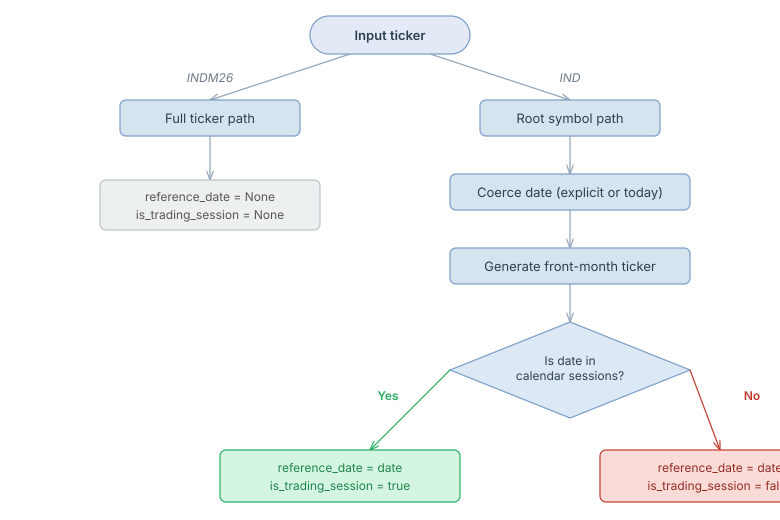

# Smart Ticker Parsing

## Summary

The ticker parser now accepts both **full tickers** (`INDM26`, `DOLK26`, `WINZ25`) and **root symbols** (`IND`, `DOL`, `WIN`).

Previously, a `reference_date` was always required to interpret the 2-digit year. The new behaviour removes this requirement for full tickers and only uses the date when resolving root symbols to their front-month contract.

## Behaviour

### Full ticker (e.g. `INDM26`)

Year and month are extracted directly from the ticker string:

- **Month** is decoded from the standard futures month code (`M` = June).
- **Year** is `2000 + yy` (`26` = 2026).

`reference_date` is **ignored** when a full ticker is provided.

### Root symbol (e.g. `IND`)

When the input does not match any `ticker_format` pattern but matches a known contract symbol, the parser resolves the front-month contract:

1. If a reference date is provided, it is used as the as-of date.
2. If omitted, **today** is used.
3. The generator produces the full ticker for that front-month, which is then parsed with the full-ticker path.

### Unknown input

Returns `Err(String)` containing `"Unable to parse ticker"`.

## API

Four free functions cover every combination of default/custom spec and with/without date:

| Function | Spec | Date |
|---|---|---|
| `parse_ticker(ticker)` | bundled default | today (for root symbols) |
| `parse_ticker_date(ticker, date)` | bundled default | explicit |
| `parse_ticker_spec(ticker, spec)` | custom | today |
| `parse_ticker_date_spec(ticker, date, spec)` | custom | explicit |

All four share the same internal implementation.

`TickerParser` provides stateful equivalents:

| Method | Date |
|---|---|
| `parser.parse(ticker)` | today |
| `parser.parse_date(ticker, date)` | explicit |

### Example

```rust
use tickerforge::{parse_ticker, parse_ticker_date, parse_ticker_spec, load_spec};

let parsed = parse_ticker("INDM26").expect("parse");
assert_eq!(parsed.year, 2026);

let parsed = parse_ticker_date("IND", "2026-06-01").expect("parse");

let spec = load_spec().expect("spec");
let parsed = parse_ticker_spec("DOLK26", &spec).expect("parse");
```

## `ParsedFuturesTicker` fields

| Field | Type | Description |
|---|---|---|
| `symbol` | `String` | Root symbol (e.g. `IND`) |
| `year` | `i32` | Contract year |
| `month` | `u32` | Contract month (1–12) |
| `tick_size` | `Option<f64>` | Minimum price increment from the contract spec |
| `lot_size` | `Option<f64>` | Contract multiplier from the contract spec |
| `contract` | `ContractSpec` | Full contract specification object |
| `reference_date` | `Option<NaiveDate>` | Date used for root-symbol resolution; `None` for full tickers |
| `is_trading_session` | `Option<bool>` | Whether `reference_date` is an exchange trading session; `None` for full tickers |

### `is_trading_session` resolution flow



When a **full ticker** is parsed, both `reference_date` and `is_trading_session` are `None` — no date context exists.

When a **root symbol** is parsed, the date (explicit or today) is used to resolve the front-month contract. The parser then checks the exchange calendar to determine whether that date is an actual trading session:

- **Weekday with exchange open** → `is_trading_session = Some(true)`
- **Weekend or exchange holiday** → `is_trading_session = Some(false)`

## Builder pattern (typestate)

`TickerParser::builder()` returns a `TickerParserBuilder<NoTicker>`.  The generic parameter
tracks whether a ticker has been set at **compile time**:

| State | `build()` | `parse()` |
|---|---|---|
| `NoTicker` | available | **not available** (compile error) |
| `HasTicker` | available | available |

Calling `.ticker(t)` transitions the builder from `NoTicker` to `HasTicker`.

| Terminal method | Returns | When to use |
|---|---|---|
| `.build()` | `Result<TickerParser, String>` | Build a reusable parser |
| `.parse()` | `Result<ParsedFuturesTicker, String>` | One-shot: load spec + parse in one call |

Builder methods: `spec_path(&Path)`, `spec(&str)`, `ticker(&str)`, `reference_date(&str)`.

`TickerParser::new()` is a convenience constructor that panics on spec failure
(the bundled spec should never fail to load).  Use `try_new()` for a fallible
alternative, or `builder().build()` for full control.

```rust
use tickerforge::TickerParser;

// Panicking constructor — simplest usage
let parsed = TickerParser::new().parse("INDM26").unwrap();

// Builder — reusable parser (bundled spec)
let parser = TickerParser::builder().build().unwrap();

// Builder — reusable parser (custom spec from string path)
let parser = TickerParser::builder().spec("/path/to/spec").build().unwrap();

// Direct constructor with string path
let parser = TickerParser::with_spec("/path/to/spec").unwrap();

// Builder — one-shot parse
let parsed = TickerParser::builder()
    .ticker("IND")
    .reference_date("2026-06-01")
    .parse()
    .unwrap();

// This would NOT compile — parse() requires HasTicker state:
// TickerParser::builder().parse();
```

## Test coverage

New tests in `tests/ticker_parsing.rs`:

- `parse_ticker_full_ind`, `parse_ticker_full_dol`, `parse_ticker_full_win`
- `parse_ticker_root_symbol_uses_today`
- `parse_ticker_unknown_errors`
- `parse_ticker_date_full_ignores_date`
- `parse_ticker_date_root_ind`, `parse_ticker_date_root_dol`, `parse_ticker_date_root_win`
- `parse_ticker_spec_full`, `parse_ticker_spec_root`, `parse_ticker_spec_unknown_errors`
- `parse_ticker_date_spec_full`, `parse_ticker_date_spec_root`, `parse_ticker_date_spec_unknown_errors`
- `parsed_ticker_has_tick_size_and_lot_size`
- `ticker_parser_new_panicking`, `ticker_parser_try_new`
- `ticker_parser_parse_date_root`, `ticker_parser_parse_date_full_ignores_date`
- `builder_build_default_spec`, `builder_build_custom_spec`
- `builder_parse_full_ticker`, `builder_parse_root_with_date`, `builder_parse_root_without_date`
- `builder_parse_custom_spec`, `builder_parse_custom_spec_with_date`
- `builder_parse_unknown_errors`, `builder_parse_full_ignores_date`, `builder_date_before_ticker`
